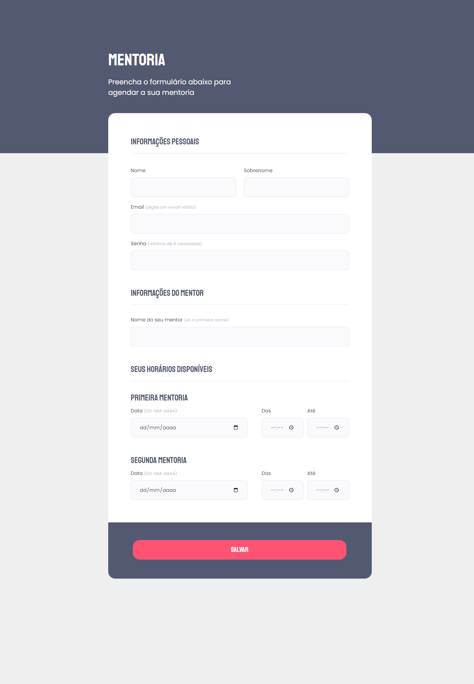

  <h1 align="center"> Explorer Stage 03 - Challenge Form 📝</h1>

## ✏️ About

This is a project developed on Stage 3 in the Explorer course at the [Rocketseat](https://www.rocketseat.com.br/) 🚀

In this challenge, it was requested to create a desktop form, the main goal was to work with different types of inputs, pseudo-classes, and HTML validation. 📆

⚙ Concepts learned in this stage
- Form structure;
- Labels, Ids and inputs;
- Fieldset and Legend;
- Styling forms, inputs and buttons; 
- Pseudo-classes;
- Validate inputs with html properties.

### 📋 The form can be seen in the image below:

 

## 🛠 Technologies

  
  

 

## 💻 How to use

To access the project click on the link below:

[🔗 Click here to access](https://brunakarina.github.io./mentoria-form/)

## 🎨 Layout

To access the project's layout in Figma click on the link below:

🔗 [View on Figma](https://www.figma.com/file/GRbH1cxHNirpUOTTzkKbdr/Stage-03---Formul%C3%A1rio-intermedi%C3%A1rio-(Copy)?node-id=0%3A1&t=VTZcsG9YOiGE6YpB-0)

## 📫 Contact

  
  

 

<h4 align="center">Made with ❤ by Bruna Karina 👋🏻</h4>
